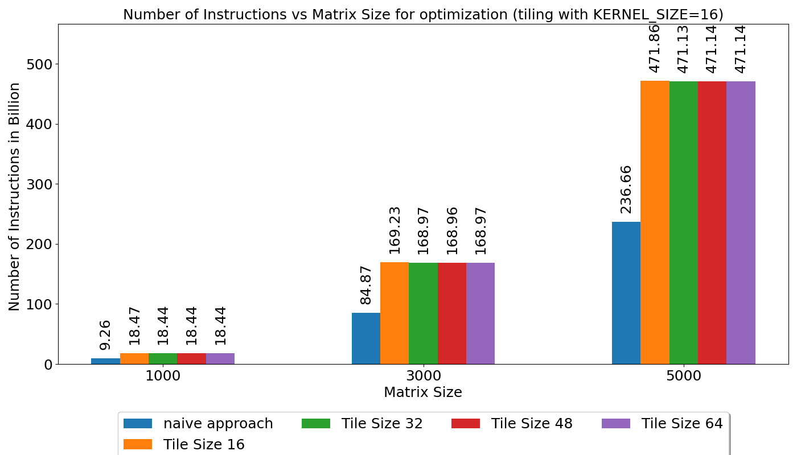
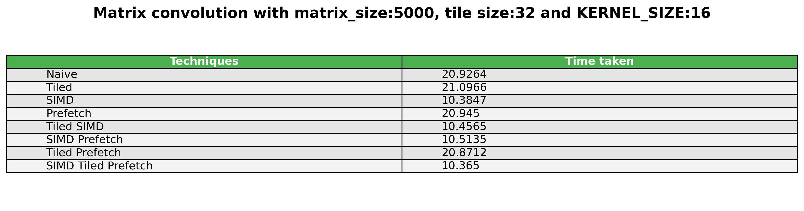
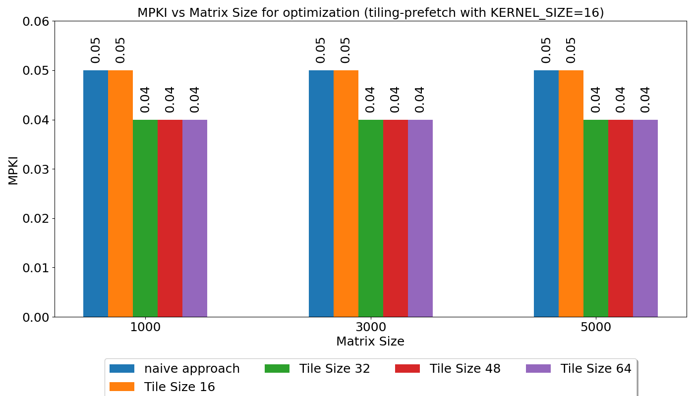

# **CS683 2024 Assignment 1**
> **Note:** `{workspace}= "pa1-chak-de-microarchitecture-team-gandiva/"`

---

## **Team Members**
- **Soumik Dutta** (23m0826)
- **SM Arif Ali** (23m0822)

---

## **System Details**
- **Processor:** Intel(R) Core(TM) i7-14650HX
- **Hyperthreading:** Turned off (Script: `{workspace}/scripts/hyper_thread_toggle.sh`)
- **Switch of Hardware prefetch:** `sudo modprobe msr ; wrmsr -a 0x1a4 $(( 2**0 | 2**1 | 2**2 | 2**3)) ; rdmsr -a -c 0x1A4`
- **CPU Frequency:** 5.2 GHz
- **Cache:**
  - **L1 D Cache:** 48 KB
    - Line size: 64 B
    - Associativity: 12
    - Number of sets: 64
  - **L1 I Cache:** 32 KB
    - Line size: 64 B
    - Associativity: 8
    - Number of sets: 64
  - **L2 Cache:** 2 MB
    - Line size: 64 B
    - Associativity: 16
    - Number of sets: 2048
  - **L3 Cache:** 30 MB
    - Line size: 64 B
    - Associativity: 12
    - Number of sets: 40960

---

## **Testing Values**
- **Element Size:** 8 Bytes (size of Double)
- **Max Tile Size:** 55x55 
  - $\sqrt{((48*1024/2)/8)}$ 
  - As $2B^2 < C$, where $C = 48$ KB
- **Tile Sizes:** [0, 4, 8, 16, 32, 48, 56, 64]
- **Matrix Sizes:** [1000, 3000, 5000, 10000, 15000, 20000]
- **Rounds:** Averaged over 5 rounds each

---

# **Task 1: Matrix Transpose**

### **1A: Tile It to See It**

**Plots:**

**Description:**

1. We observe instructions increases but MPKI dropped when moving from naive to tiling due to elements are getting reused before being replaced.

2. As we increase tile size we observe a decrease in MPKI until it saturates. We found tile size 32 to be optimal as MPKI is minimum and speedup is maximum.

3. we achieved around 2.6x speedup compared to naive. The speedup was contributed by the tiling technique.

---

### **1B: Fetch It but with Soft Corner (Software Prefetching)**

**Plots:**

**Description:**

1. We observe instructions increases when moving from naive to software prefetching. This is due to extra prefetch instructions generated.

2. MPKI also increases. This could be due to some prefetches are made which are outside the bounds of the input matrix.

3. we achieved around 1.45x speedup due to prefetching technique. This is primarily due to prefetching columns lines in destination matrix.

---

### **1C: Tiling + Prefetching**

**Plots:**

**Description:**

1. We observe instructions increases when moving from naive to prefetch+tiling. This is expected as both tiling and prefetch techniques generated more instructions when considered in isolation.

2. There is an observable drop in MPKI across matrix sizes and tile sizes when compared with naive method.

3. As we increase tile size we observe a decrease in MPKI until it saturates. From matrix size 5000, MPKI is fairly constant when looking at each tile size.

4. we achieved around 2.8x speedup compared to naive. The speedup was contributed by combined effect of tiling and prefetching technique.

---

### **All Techniques Together**

**Plot:**

**Description:**

- The tiling + prefetch technique yields the best speedup.

---

# **Task 2: 2D Convolution**

### **2A: Shhh SIMD in Action**

**Plots:**

**Description:**

1. As we move to SIMD we see instructions increases. We inspected the assembly and observed multiple vmovapd instructions being generated for loading the 256 bit ymm0 register.

2. We achieved 2x speedup using simd technique. Speedup is due to vectorised operations.

---

### **2B: Tile It Again**

**Plots:**

**Description:**

1. We observe no change in MPKI for when applying tiled 2D convolution. Since in naive approach the access pattern is not evicting lines that contains useful data before they are used.

2. As we increase kernel size from 8 to 16 MPKI drops. Matrix size has no measurable effect.

3. We didn't achieve any speedup due to tiling as in the naive approach the input matrix is accessed row wise and kernel itself have a tiling effect on the input matrix.

---

### **2C: Software Prefetching**

**Plots:**

**Description:**

1. We see an increase in number of instruction when applying software prefetching as prefetch instructions are now introduced.

2. For a particular kernel size we see similar L1D-MPKI, but decreases slightly when kernel size is increased to 16.

3. We didnot achieve speedup using software prefetching technique. Multiple prefetch degree and distance were tried but we weren't able to find the sweet spot.

---

### **2D: Hum Saath Saath Hain**

**Table:**

---

#### **SIMD + Prefetch**

**Plots:**

#### **Tiling + Prefetch**

**Plots:**

#### **Tiling + SIMD**

**Plots:**

#### **Tiling + SIMD + Prefetch**

**Plots:**

### **All Techniques Together**

**Plot:**
Without compiler optimizations

**Plot:**
With -O3 flag + loop unrolling + H/W Prefetchers turned on

With AVX512

**Description:**

- In this we observe simd techniques gives the best speedup. Other techniques doesnt work due to the reasons discussed above.

### **Conclusion**

- For most of the assignment codes, we observed different results on different machines. Thus to reason about such behaviour it is crucial to know how exactly the underlying hardware is working. Especially for software prefetching in convolution, why it did not work at all is still a gray area for us.
---
